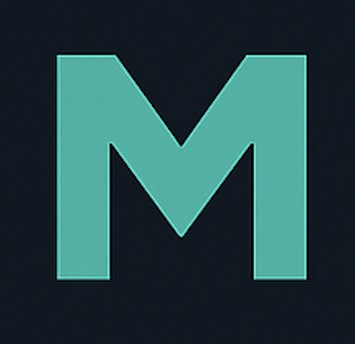

# Mashter's Portfolio

A modern, responsive portfolio website built with Next.js and Chakra UI, showcasing my work in AI, machine learning, and full-stack development.



## 🚀 Live Demo

Visit the live portfolio: https://mashcodes10.github.io/

## ✨ Features

- **Modern Design**: Clean, professional interface with glass-morphism effects
- **Responsive**: Optimized for all devices and screen sizes
- **Dark/Light Mode**: Automatic theme switching with smooth transitions
- **Interactive Navigation**: Smooth page transitions with framer-motion
- **Project Showcase**: Dedicated sections for current and completed works
- **Campus Involvement**: Highlighting university activities and achievements
- **Tech Radar**: Curated list of tools and frameworks I'm following
- **Contact Integration**: Professional contact form with scheduling options

## 🛠️ Tech Stack

- **Framework**: Next.js 13+ (Pages Router)
- **UI Library**: Chakra UI
- **Styling**: Emotion CSS-in-JS
- **Animations**: Framer Motion
- **Icons**: React Icons (Ionicons)
- **Language**: TypeScript/JavaScript
- **Deployment**: [Your deployment platform]

## 📁 Project Structure

```
├── components/           # Reusable UI components
│   ├── layouts/         # Page layout components
│   ├── ui/              # Chakra UI components
│   └── ...              # Other components
├── pages/               # Next.js pages
│   ├── works/           # Individual project pages
│   ├── index.js         # Homepage
│   ├── works.js         # Projects overview
│   ├── posts.js         # Tech radar
│   ├── campus.js        # Campus involvement
│   └── contact.js       # Contact page
├── public/              # Static assets
│   └── images/          # Project images and thumbnails
├── lib/                 # Utility functions and theme
└── styles/              # Global styles
```

## 🎨 Sections

### 🏠 Homepage
- Personal introduction and current focus
- Timeline of academic and professional milestones
- Featured projects with smooth navigation
- Professional social links

### 💼 Works
- **Recent Works**: Current active projects
  - Khanflow - AI-powered scheduling platform
  - MLT GEN AI Partner Bot - SEC filings analysis
  - Sim2Real Object Detection - YOLO fine-tuning
  - Tech-Talk series - Healthcare AI workshops

- **Recently Completed**: Academic projects
  - TACC HPC Insurance Recommender
  - NYC Airbnb Price Prediction

### 📡 Radar
- Curated collection of open-source projects and tools
- Technologies that inspire and shape my work
- Direct links to GitHub repositories

### 🏫 Campus
- University involvement and leadership roles
- Academic achievements and recognition
- Campus events and initiatives

### 📞 Contact
- Professional contact information
- Meeting scheduling integration
- Social media links

## 🚀 Getting Started

### Prerequisites
- Node.js 16+ 
- npm or pnpm

### Installation

1. Clone the repository:
```bash
git clone https://github.com/mashcodes10/mashter-portfolio.git
cd mashter-portfolio
```

2. Install dependencies:
```bash
npm install
# or
pnpm install
```

3. Start the development server:
```bash
npm run dev
# or
pnpm dev
```

4. Open [http://localhost:3000](http://localhost:3000) in your browser

### Building for Production

```bash
npm run build
npm start
```

## 🎨 Customization

### Themes and Colors
- Main theme configuration: `lib/theme.js`
- Custom color palette: `tealBlue` scheme
- Dark/light mode support with `useColorModeValue`

### Adding New Projects
1. Add project images to `public/images/works/[project-name]/`
2. Create project page in `pages/works/[project-name].js`
3. Add project card to `pages/works.js`
4. Update thumbnails in `public/images/thumbnails/`

### Styling
- Chakra UI components with custom theme
- Glass-morphism effects with backdrop filters
- Consistent spacing and typography
- Responsive design patterns

## 📄 License

This project is open source and available under the [MIT License](LICENSE).

## 🤝 Contributing

This is a personal portfolio project, but feel free to:
- Report bugs or issues
- Suggest improvements
- Fork for your own portfolio (with proper attribution)

## 📱 Contact

- **Email**: mashiur.khan@outlook.com
- **LinkedIn**: [@mashter](https://linkedin.com/in/mashter/)
- **GitHub**: [@mashcodes10](https://github.com/mashcodes10)

---

Built with ❤️ by [Md. Mashiur Rahman Khan](https://github.com/mashcodes10)
